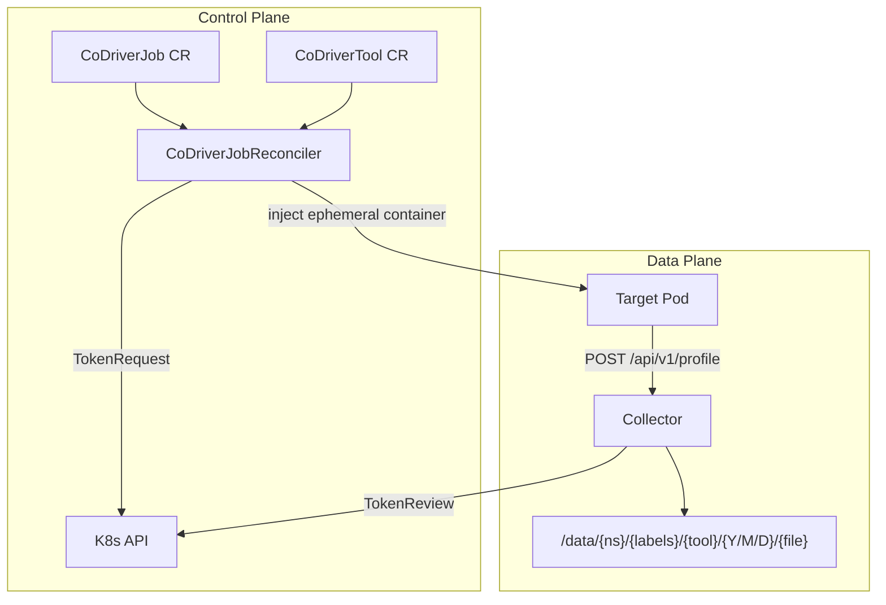

# AGENTS.md — KubeCoDriver

<!-- tags: navigation, architecture, development -->

> Kubernetes operator that injects ephemeral containers into target pods for profiling, diagnostics, and chaos engineering. Built with Kubebuilder (controller-runtime). Go + Shell.

## Table of Contents

- [Directory Map](#directory-map) — Where things live
- [Component Map](#component-map) — How subsystems relate
- [Key Entry Points](#key-entry-points) — Start reading here
- [CRD Quick Reference](#crd-quick-reference) — Custom resource structure
- [Auth & Data Flow](#auth--data-flow) — Token-based controller↔collector communication
- [Power Tools Contract](#power-tools-contract) — How shell-based tools integrate
- [Config & Deployment](#config--deployment) — Kustomize, Helm, CI
- [Repo-Specific Patterns](#repo-specific-patterns) — Deviations from defaults
- [Detailed Documentation](#detailed-documentation) — Deep-dive files
- [Custom Instructions](#custom-instructions) — Human/agent-maintained knowledge

## Directory Map

<!-- tags: navigation, directory-structure -->

```
cmd/main.go                    # Controller manager entry point
cmd/collector/main.go          # Collector server entry point
api/v1alpha1/                  # CRD types: CoDriverJob, CoDriverTool, common types
internal/controller/           # Reconcilers (CoDriverJob + CoDriverTool)
pkg/collector/server/          # HTTP(S) profile receiver
pkg/collector/storage/         # Hierarchical file storage
pkg/collector/auth/            # K8s token generation/validation
power-tools/{aperf,tcpdump,chaos,common}/  # Shell-based tool images
config/                        # Kustomize: crd/, rbac/, manager/, certmanager/, default/
helm/kubecodriver-operator/             # Helm chart (values.yaml, values-eks.yaml)
deploy/collector/              # Standalone collector Kustomize overlay
examples/                      # CoDriverJob YAML examples by tool type
cicd-scripts/                  # Build/deploy orchestration scripts
helper_scripts/                # ECR sync, namespace secrets, collector inspection
test/e2e/                      # E2E tests (envtest-based)
test/e2e-kind/                 # Kind cluster E2E tests + setup/teardown scripts
docs/                          # Architecture, security, collector, testing docs
.github/workflows/             # CI, test, release, security-scan
```

## Component Map

<!-- tags: architecture, components -->



## Key Entry Points

<!-- tags: navigation, code-reading -->

| What | Where |
|---|---|
| Controller startup | `cmd/main.go` — manager setup, scheme registration, reconciler wiring |
| Core reconciliation | `internal/controller/codriverjob_controller.go` — `Reconcile()` is the main loop |
| Config reconciler | `internal/controller/codrivertool_controller.go` |
| Collector server | `pkg/collector/server/server.go` — `POST /api/v1/profile` handler |
| Storage logic | `pkg/collector/storage/manager.go` — `SaveProfile()` |
| Token auth | `pkg/collector/auth/k8s_token.go` (generation), `k8s_validator.go` (validation) |
| CRD types | `api/v1alpha1/codriverjob_types.go`, `codrivertool_types.go`, `common_types.go` |
| Interfaces | `pkg/collector/server/interfaces.go` — `StorageManager`, `TokenValidator` |

## CRD Quick Reference

<!-- tags: api, data-model -->

**CoDriverJob** — Declares a profiling job:
- `spec.targets.labelSelector` — Which pods to target
- `spec.tool.name` — References a CoDriverTool by name
- `spec.tool.duration` — How long to run
- `spec.tool.args` — Appended to (not overriding) CoDriverTool's `defaultArgs`
- `spec.output.mode` — `ephemeral` | `pvc` | `collector`
- `status.phase` — Tracks lifecycle; conditions: Ready, Running, Completed, Failed, Conflicted

**CoDriverTool** — Admin-defined tool template:
- `spec.image` — Container image for the ephemeral container
- `spec.securityContext` — `allowPrivileged`, `allowHostPID`, `runAsRoot`, `capabilities`
- `spec.allowedNamespaces` — Namespace-scoped access control (empty = all)
- `spec.defaultArgs` — Base args that users cannot override

Config lookup order: current namespace → `kubecodriver-system` namespace.

## Auth & Data Flow

<!-- tags: security, architecture -->

1. Controller generates short-lived SA token via K8s TokenRequest API
2. Token passed to ephemeral container as env var
3. Tool sends profile data to collector: `POST /api/v1/profile` with `Authorization: Bearer <token>`
4. Collector validates via K8s TokenReview (audience: `kubecodriver-sdk-collector`)
5. Metadata extracted from headers: `X-CoDriverJob-Namespace`, `X-CoDriverJob-Job-ID`, `X-CoDriverJob-Matching-Labels`, `X-CoDriverJob-Filename`
6. Profile saved to hierarchical path: `/{ns}/{labels}/{tool}/{date}/{file}`

## Power Tools Contract

<!-- tags: development, shell -->

Each power tool image follows a standard pattern:
- `entrypoint.sh` — Main script; reads env vars set by controller, runs the tool, calls `send-profile.sh`
- `send-profile.sh` — Shared script (`power-tools/common/`) that POSTs results to collector with auth headers
- Chaos tool dispatches to sub-scripts: `cpu-chaos.sh`, `memory-chaos.sh`, `network-chaos.sh`, `storage-chaos.sh`, `process-chaos.sh`

## Config & Deployment

<!-- tags: deployment, ci -->

**Kustomize** (`config/`): Standard Kubebuilder layout. `config/default/kustomization.yaml` is the main overlay.

**Helm** (`helm/kubecodriver-operator/`): `values.yaml` for general config, `values-eks.yaml` for EKS-specific overrides. Templates generate collector deployment and CoDriverTool resources.

**CI** (`.github/workflows/`):
- `ci.yml` — yamllint → go test → build → K8s validation (on PR/push to main)
- `test.yml` — Unit tests (on all pushes)
- `release.yml` — Full image build and publish
- `security-scan.yml` — govulncheck (weekly + on push to main)
- Dependabot updates Go modules, Docker base images, and GitHub Actions weekly

**Linting**: golangci-lint (`.golangci.yml`) skips test files; yamllint (`.yamllint.yml`) at 120-char line limit, skips Helm templates.

## Repo-Specific Patterns

<!-- tags: conventions, gotchas -->

- **Ephemeral containers, not sidecars** — Tools are injected via the ephemeral containers API. No pod restarts.
- **Conflict detection** — `checkForConflicts()` prevents multiple CoDriverJobs from targeting the same pods simultaneously.
- **POSIX-compliant label extraction** — `extractMatchingLabels()` sanitizes K8s labels for filesystem paths.
- **Security context inheritance** — Ephemeral container security context is derived from CoDriverTool, not from the target pod.
- **Tool args are additive** — `CoDriverJob.spec.tool.args` are appended to `CoDriverTool.spec.defaultArgs`; users cannot override admin-defined defaults.
- **Distroless non-root** — Controller image runs as UID 65532 on `gcr.io/distroless/static:nonroot`.
- **Go version pinned** in `.go-version` file (used by CI via `go-version-file`).
- **`make generate`** must run before tests (generates deepcopy methods and manifests).

## Detailed Documentation

<!-- tags: reference -->

Deep-dive documentation in `.agents/summary/`:

| File | Content |
|---|---|
| `index.md` | Documentation map with guidance on which file to consult |
| `architecture.md` | System design, auth flow, reconciliation lifecycle |
| `components.md` | Component responsibilities and key functions |
| `interfaces.md` | Go interfaces, HTTP API, CRD field reference |
| `data_models.md` | Type hierarchy and condition types |
| `workflows.md` | Reconciliation flow, CI/CD, E2E testing, deployment |
| `dependencies.md` | Go modules, build tools, infrastructure requirements |
| `review_notes.md` | Documentation gaps and recommendations |

## Custom Instructions
<!-- This section is for human and agent-maintained operational knowledge.
     Add repo-specific conventions, gotchas, and workflow rules here.
     This section is preserved exactly as-is when re-running codebase-summary. -->
